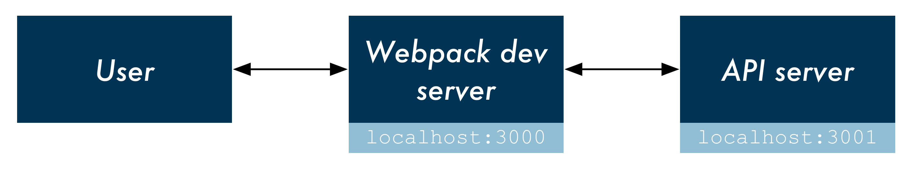

# Create-Reduxpress-App

Boilerplate for React/Redux front-end and Node/Express back-end API.
 
Based-on [Create-React-App with a Server](https://www.fullstackreact.com/articles/using-create-react-app-with-a-server/) article.

## Overview

`create-react-app` configures a Webpack development server to run on `localhost:3000`. This development server will bundle all static assets located under `client/src/`. All requests to `localhost:3000` will serve `client/index.html` which will include Webpack's `bundle.js`.

In this example, the React component `App` makes a request to an API server (`server.js`). The user's browser visits the Webpack dev server at `localhost:3000`. Then the React client communicates with the API server when needed at `localhost:3001`:

This setup uses [node-foreman](https://github.com/strongloop/node-foreman) for process management. Executing `npm start` instructs Foreman to boot both the Webpack dev server and the API server.
